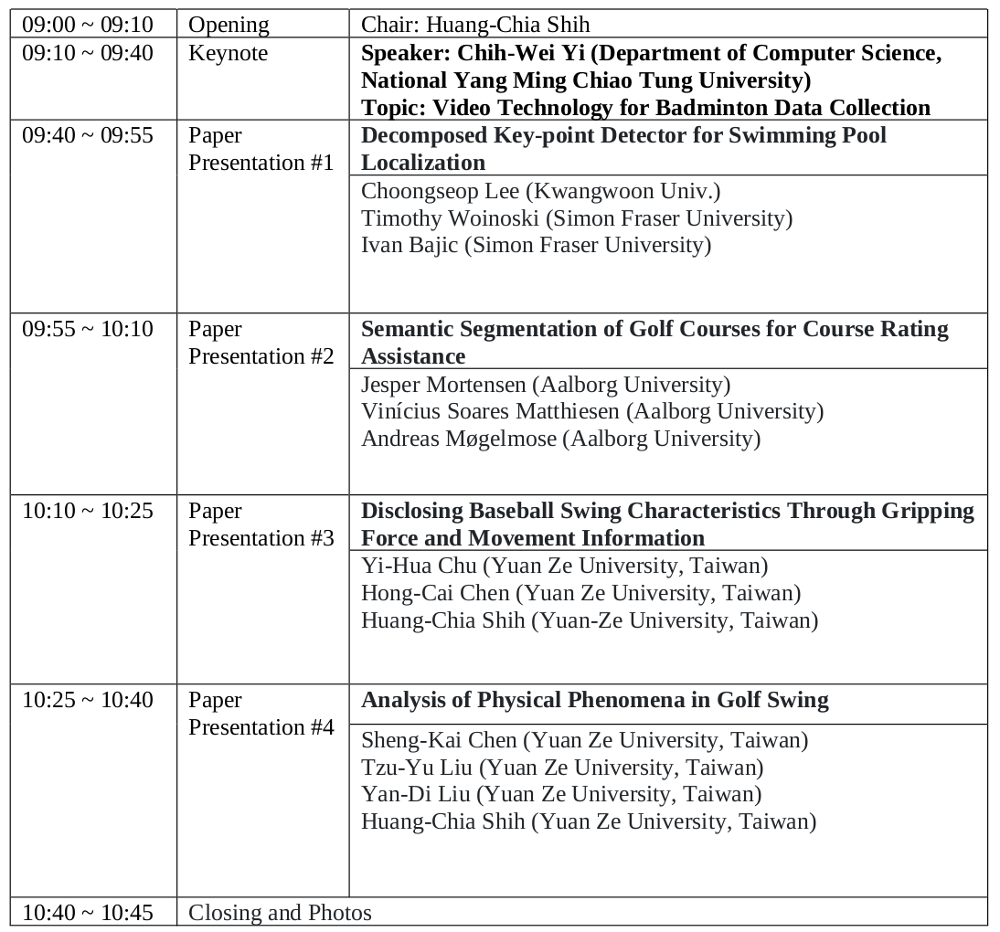

<!-- # **The 4th Artificial Intelligence in Sports (AI-Sports) Workshop** 
***
{:toc}
***
-->

[**In Conjunction with ICME 2023 July 10-14, 2023, Brisbane, Australia**](https://www.2023.ieeeicme.org/)

## **Overview**

The rise in potential programs demonstrates encouraging technical developments in the sports sector. Along with its advantages, it also has drawbacks. For instance, it is evident that additional data is required or insufficient to produce learning models and artificial intelligence. It is clear that big data sports analytics has a robust and positive link to maximizing the sports team's potential, and any club that does not aggressively combine with big data analytics would find itself at a significant disadvantage.  

In general, coaches and teams might find that computers are more accurate than people in identifying frequent errors and enhancing plays quickly. In particular, media sources are putting more of an emphasis on using technology to improve the spectator experience, and AI is influencing how sports fans interact with media in this way. Effective coaching is a skill that takes practice and develops with time; it is also a science that is not without flaws. The use of various sensors for the collection of bioinformatics data has fast gained popularity in recent years. While this is going on, numerous research areas, including computer vision, sensor technology, wearable technology, machine learning, and data-driven techniques, have made enormous strides recently and have had a significant impact on many elements of sports. In addition, the joint evaluation of many sports medicine techniques. Furthermore, the joint assessment of multiple modalities for sports data analytics offers appealing innovations to advance the field.  

The development and improvement of sports in recent years have been greatly assisted by data-driven machine learning techniques. This information can be used by coaches and athletes to help them develop their teams more effectively. For instance, the popularity of sports like football fuels the development of AI and machine learning. With today's technology, precise information and tactics may be gleaned from the data to give coaches and players a clearer understanding of the overall situation. By adding context to the collected data, coaches and analysts can allocate more time toward developing strategies.  

This workshop is open to anyone who is interested in sports content analytics. To cover the rapid progress of emerging areas, we plan to focus our target field on three topics:  

1. Analysis of sports tactics using machine learning and image processing. Applications in areas like event reasoning and tactic analysis are the focus of this workshop. Machine learning can be used to assess video content in offline services by using previous information. Latent knowledge that has been uncovered can be employed in online services to provide real-time strategy recommendations. Recent times have seen a lot of interest in the optimization of player posture, movement, and positioning using deep learning techniques.  

2. Personalized athletic training and rehabilitation using big data/machine learning methodologies. The use of computing in athletic training and recovery is highlighted in this session. The data has the ability to completely transform the sports sector and significantly enhance the health and performance of players. Sports rarely use big data analytics, yet history has shown that doing so leads to speedier and more effective performance improvements for athletes.  

3. Making the invisible visible in sports. The research field includes human-computer interaction, AR/VR immersive data visualization, and UX/UI interaction design with human factors. Sports data is analyzed to create avatar of players and enables them to visually study a situation and compare what the avatar would have done and what they should have done.  

The goal of this workshop is to advance the field of research on the techniques of AI for sports data, develop more techniques to accurately evaluate and organize the data, and further strengthen the synergy between sports and science. Papers about machine learning, vision processing, and data sciences in sports and new forms of sports technologies are encouraged for submission.   

## **Organizers**  
- **Huang-Chia Shih** (Yuan Ze University, Taiwan)

- **Takahiro Ogawa** (Hokkaido University, Japan)  

- **Jenq-Neng Hwang** (University of Washington, USA)

- **Rainer Lienhart** (Augsburg University, Germany)

- **Thomas B. Moeslund** (Aalborg University, Denmark)

## **Duration** 
9:00 AM ~ 10:45 AM, July 14 (Friday), 2023

## **TPC Members**  
- Tiziana D’Orazio (National Research Council of Italy, Italy)
- Hsu-Yung Cheng (National Central University, Taiwan)
- James Little (University of British Columbia, Canada)
- Chih-Chang Yu (Chung Yuan Christian University, Taiwan)
- Huang-Chia Shih (Yuan Ze University, Taiwan)
- Jenq-Neng Hwang (University of Washington, USA)
- Takahiro Ogawa (Hokkaido University, Japan)
- Rainer Lienhart (Augsburg University, Germany)
- Hideo Saito (Keio University, Japan)
- Michele Merler (IBM Research, USA)
- Sho Takahashi (Hokkaido University, Japan)
- Shin'ichi Satoh (National Institute of Informatics, Japan)

## Schedule

<!---) -->
<!--- -->

| Time          | Event             | Topic / Speaker(s)                                |
| :------------ | :---------------- | :------------------------------------------------ | 
| 09:00 ~ 09:10	| Opening     | 
 Chair : Huang-Chia Shih                                   |
| 09:10 ~ 09:40	| Keynote	          | Topic: Video Technology for Badminton Data Collection Speaker: Chih-Wei Yi  (Department of Computer Science, National Yang Ming Chiao Tung University)|
| 09:40 ~ 09:55	| Paper Presentation #1	| Topic : Decomposed Key-point Detector for Swimming Pool Localization Choongseop Lee (Kwangwoon Univ.) Timothy Woinoski (Simon Fraser University) Ivan Bajic (Simon Fraser University) |
| 09:55 ~ 10:10	| Paper Presentation #2	| Topic : Semantic Segmentation of Golf Courses for Course Rating Assistance Jesper Mortensen (Aalborg University) Vinícius Soares Matthiesen (Aalborg University) Andreas Møgelmose (Aalborg University) |
| 10:10 ~ 10:25	| Paper Presentation #3	| Topic : Disclosing Baseball Swing Characteristics Through Gripping Force and Movement Information Yi-Hua Chu (Yuan Ze University, Taiwan) Hong-Cai Chen (Yuan Ze University, Taiwan) Huang-Chia Shih (Yuan-Ze University, Taiwan) |
| 10:25 ~ 10:40	| Paper Presentation #4	| Topic : Analysis of Physical Phenomena in Golf Swing Sheng-Kai Chen (Yuan Ze University, Taiwan) Tzu-Yu Liu (Yuan Ze University, Taiwan) Yan-Di Liu (Yuan Ze University, Taiwan) Huang-Chia Shih (Yuan Ze University, Taiwan) |
| 10:40 ~ 10:45	| Closing and Photos| --- |

## **History**  
- [The 3rd Artificial Intelligence in Sports (AI-Sports) Workshop](https://ai-sports22.github.io/)
- [AI-Sports '21: 2nd International Workshop on Artificial Intelligence in Sports](https://oz.nthu.edu.tw/~d917904/AI-Sports21.html)
- [2020 IEEE International Workshop of Artificial Intelligence in Sports (1st AI-Sports)](https://2020.ieeeicme.org/www.2020.ieeeicme.org/index.php/workshops/index.html#Workshop1)

## **Important dates**
- Submission deadline : April 13
- Review submission deadline : April 22
- Author notification : April 25
- Camera ready submission  : May 1
